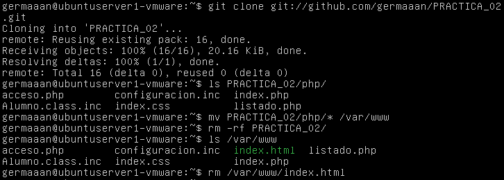
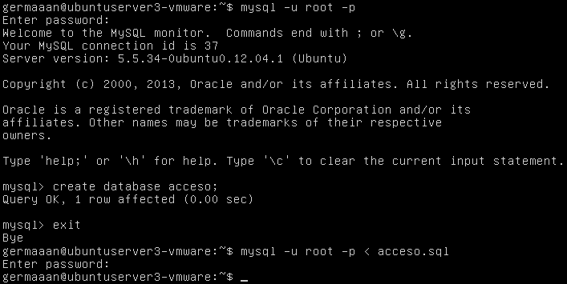
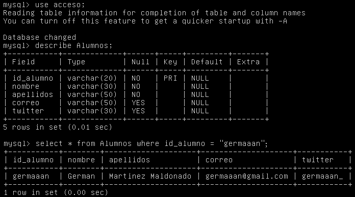
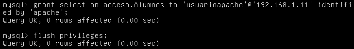
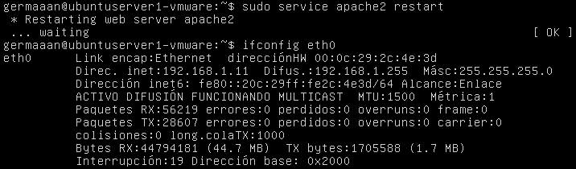
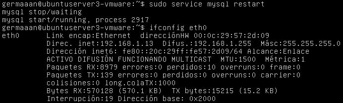

# Práctica 3: Diseño de máquinas virtuales
# German Martinez Maldonado
# Publicado bajo licencia GNU GENERAL PUBLIC LICENSE Version 3

Esta práctica consiste en realizar el diseño de una máquina virtual para una aplicación específica. Para realizar un buen diseño hay que tener en cuenta que los recursos son un bien preciado, así que no debemos desperdiciarlos, esto significa que deberemos intentar ajustarnos lo máximo posible a las necesidades reales de nuestra aplicación. En este caso, voy a intentar buscar un rendimiento aceptable ajustando el número de procesadores y la cantidad de memoria RAM.

La aplicación para la que voy a diseñar la máquina virtual es la misma que desarrollé para las prácticas anteriores, la diferencia en este caso es que voy a basarme en un escenario donde la seguridad tuviera un nivel más exigente, por lo que se montará el servidor web en una máquina y la base de datos en otra máquina diferente. Para probar la eficiencia de las diferentes configuraciones, voy a comprobar el rendimiento de las mismas bajo diferentes sistemas operativos y servidores web.

El software de virtualización que voy a usar es VMware Player.

### Prueba 1: Ubuntu Server + Apache + MySQL

Voy a realizar esta configuración sobre un **Ubuntu 12.04.3 Server 32 bits**, con un servidor web **Apache** y un sistema gestor de base de datos **MySQL**. Lo primero que hay que hacer es configurar el interfaz de red de ambas máquinas para que tengan una ip fija (necesario para realizar las configuraciones entre las máquinas), para ello primero hay que saber cual es la puerta de enlace de las máquinas virtuales, lo que se puede comprobar con **`route -n`**; en mi caso es **192.168.1.1**, por lo que las direcciones a asignar tienen que estar en la misma subred. Conocida esta dirección, lo siguiente es editar el archivo **/etc/network/interfaces** para que quede la siguiente manera:

```
auto lo
iface lo inet loopback

auto eth0
iface eth0 inet static
  address 192.168.1.X	//la dirección IP estática de la máquina
  netmask 255.255.255.0
  broadcast 192.168.1.255
  gateway 192.168.1.1
dns-nameservers 192.168.1.1
```

Para que la configuración se haga efectiva, hay que bajar y subir la interfaz:

```
sudo ifdown eth0
sudo ifup eth0
```

En la máquina con el servidor Apache habrá que instalar los siguiente paquetes: **apache2, php5, libapache2-mod-php5, php5-cli y php5-mysql**.

```
sudo apt-get install apache2 php5 libapache2-mod-php5 php5-cli php5-mysql
```

En la máquina con el gestor MySQL habrá que instalar los siguientes paquetes: **mysql-server, mysql-client, libmysqlclient-dev**.

```
sudo apt-get install mysql-server mysql-client libmysqlclient-dev
```

En la máquina del servidor, le damos un nombre al servidor web introduciendo la línea **ServerName apache** en el archivo **/etc/apache2/apache2.conf**. Ahora me descargo la aplicación desde el repositorio de mi práctica anterior para adaptarla para esta práctica, para lo que primero tengo que instalar `git`. Para que la aplicación quede "instalada" en este servidor, movemos el contenido de la **php** dentro de **PRACTICA_02** a la carpeta **/var/www** (además eliminamos el archivo index.html que Apache crea como prueba de que el servidor funciona correctamente).

```
sudo apt-get install git
git clone git://github.com/germaaan/PRACTICA_02.git
```



Como la base de datos va a estar en otra máquina diferente, hay que editar el archivo **/var/www/configuracion.inc** para indicar la dirección IP de la máquina en la que se encuentra la base de datos, que en este caso es **192.168.1.13**, quedando el archivo de la siguiente forma:

```
<?php
          define("DB_DSN","mysql:host=192.168.1.13;port=3306;dbname=acceso");
          define("DB_USUARIO","usuarioapache");
          define("DB_PASS","apache");
          define("TABLA_ALUMNOS","Alumnos");
?>
```

Ahora en la máquina del sistema gestor de la base de datos, accedo a la base de datos, creo la base de datos que va a utilizar la aplicación e importo el archivo con los datos de la base de datos.

```
mysql -u root -p

mysql> create database acceso;
mysql> exit;

mysql -u root -p < acceso.sql
```



Compruebo que la base de datos se ha importado correctamente.

```
mysql> use acceso;
mysql> describe Alumnos;
mysql> select * from Alumnos where id_alumno = "germaaan";
```



Para que la base de datos sea accesible desde otra máquina, primero hay que editar el archivo **/etc/mysql/my.cnf** y comentamos la línea **"bind-address = 127.0.0.1"**, así la interfaz local de escucha del servidor MySQL responderá a peticiones que le lleguen desde cualquier dirección y no solo del host local. Lo único que falta para poder acceder a la base de datos de forma remota es crear un usuario con los permisos necesarios (en est caso solo ejecución de consultas de selección) indicando la dirección IP desde la que se va a conectar; para que se pueda conectar desde la máquina del servidor Apache con dirección **192.168.1.11** se crea el usuario de la siguiente forma:

```
mysql -u root -p

mysql> grant select on acceso.Alumnos to 'usuarioapache'@'192.168.1.11' identified by 'apache';
mysql> flush privileges;
```



Para asegurarnos que todas las configuraciones se han guardado correctamente, reiniciamos los servicios de Apache y MySQL. Ade

```
sudo service apache2 restart
```



```
sudo service mysql restart
```



### Prueba 2: Ubuntu Server + nginx + MySQL

Sobre la misma versión de Ubuntu que la prueba anterior y el mismo sistema gestor de base de datos, pero ahora con un servidor **nginx**. Los paquetes a instalar en la máquina del servidor nginx son: **nginx y php5-fpm**.

```
sudo apt-get install nginx php5-fpm
```

Como ya he modificado la aplicacion para que funcione en esta nueva versión, en vez de volver a configurarla, la subo al repositorio de la practica 3 y la descargo desde la nueva máquina.
