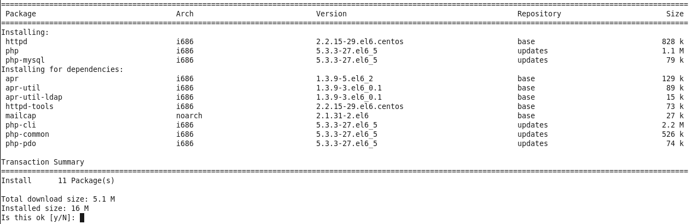
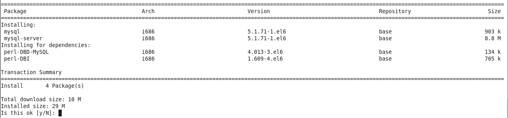
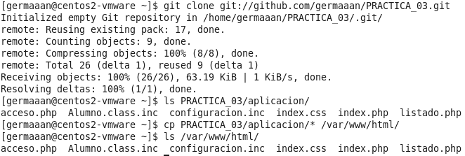
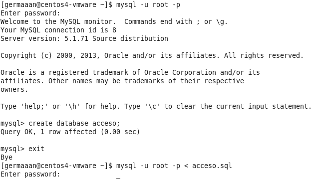
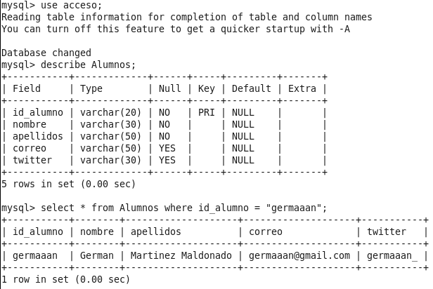
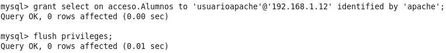
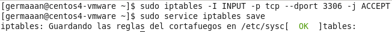
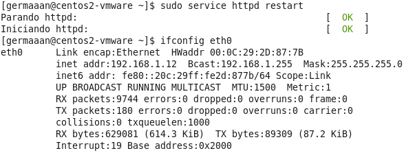
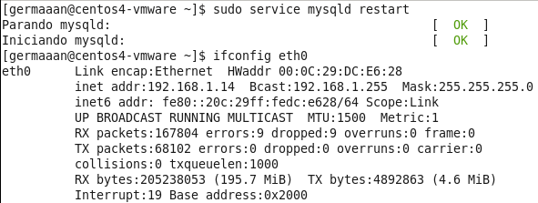

# Práctica 3: Diseño de máquinas virtuales
# German Martinez Maldonado
# Publicado bajo licencia GNU GENERAL PUBLIC LICENSE Version 3

Esta práctica consiste en realizar el diseño de una máquina virtual para una aplicación específica. Para realizar un buen diseño hay que tener en cuenta que los recursos son un bien preciado, así que no debemos desperdiciarlos, esto significa que deberemos intentar ajustarnos lo máximo posible a las necesidades reales de nuestra aplicación. En este caso, voy a intentar buscar un rendimiento aceptable ajustando el número de procesadores y la cantidad de memoria RAM.

La aplicación para la que voy a diseñar la máquina virtual es la misma que desarrollé para las prácticas anteriores, la diferencia en este caso es que voy a basarme en un escenario donde la seguridad tuviera un nivel más exigente, por lo que se montará el servidor web en una máquina y la base de datos en otra máquina diferente. Para probar la eficiencia de las diferentes configuraciones, voy a comprobar el rendimiento de las mismas bajo diferentes sistemas operativos.

El software de virtualización que voy a usar es VMware Player.

### Prueba 1: Ubuntu Server + Apache + MySQL

Voy a realizar esta configuración sobre un **Ubuntu 12.04.3 Server 32 bits**, con un servidor web **Apache** y un sistema gestor de base de datos **MySQL**. Lo primero que hay que hacer es configurar el interfaz de red de ambas máquinas para que tengan una ip fija (necesario para realizar las configuraciones entre las máquinas), para ello primero hay que saber cual es la puerta de enlace de las máquinas virtuales, lo que se puede comprobar con **`route -n`**; en mi caso es **192.168.1.1**, por lo que las direcciones a asignar tienen que estar en la misma subred. Conocida esta dirección, lo siguiente es editar el archivo **/etc/network/interfaces** para que quede la siguiente manera:

```
auto lo
iface lo inet loopback

auto eth0
iface eth0 inet static
  address 192.168.1.X		//Dirección estática que le vamos a dar a la máquina. Apache = 11, MySQL = 13
  netmask 255.255.255.0
  broadcast 192.168.1.255
  gateway 192.168.1.1
dns-nameservers 192.168.1.1
```

Para que la configuración se haga efectiva, hay que bajar y subir la interfaz:

```
sudo ifdown eth0
sudo ifup eth0
```

En la máquina con el servidor Apache habrá que instalar los siguiente paquetes: **apache2, php5, libapache2-mod-php5, php5-cli y php5-mysql**.

```
sudo apt-get install apache2 php5 libapache2-mod-php5 php5-cli php5-mysql
```

En la máquina con el gestor MySQL habrá que instalar los siguientes paquetes: **mysql-server, mysql-client, libmysqlclient-dev**.

```
sudo apt-get install mysql-server mysql-client libmysqlclient-dev
```

En la máquina del servidor, le damos un nombre al servidor web introduciendo la línea **ServerName apache** en el archivo **/etc/apache2/apache2.conf**. Ahora me descargo la aplicación desde el repositorio de mi práctica anterior para adaptarla para esta práctica, para lo que primero tengo que instalar `git`. Para que la aplicación quede "instalada" en este servidor, movemos el contenido de la **php** dentro de **PRACTICA_02** a la carpeta **/var/www** (además eliminamos el archivo index.html que Apache crea como prueba de que el servidor funciona correctamente).

```
sudo apt-get install git
git clone git://github.com/germaaan/PRACTICA_02.git
```


Como la base de datos va a estar en otra máquina diferente, hay que editar el archivo **/var/www/configuracion.inc** para indicar la dirección IP de la máquina en la que se encuentra la base de datos, que en este caso es **192.168.1.13**, quedando el archivo de la siguiente forma:

```
<?php
          define("DB_DSN","mysql:host=192.168.1.13;port=3306;dbname=acceso");
          define("DB_USUARIO","usuarioapache");
          define("DB_PASS","apache");
          define("TABLA_ALUMNOS","Alumnos");
?>
```

Ahora en la máquina del sistema gestor de la base de datos, accedo a la base de datos, creo la base de datos que va a utilizar la aplicación e importo el archivo con los datos de la base de datos.

```
mysql -u root -p

mysql> create database acceso;
mysql> exit;

mysql -u root -p < acceso.sql
```


Compruebo que la base de datos se ha importado correctamente.

```
mysql> use acceso;
mysql> describe Alumnos;
mysql> select * from Alumnos where id_alumno = "germaaan";
```


Para que la base de datos sea accesible desde otra máquina, primero hay que editar el archivo **/etc/mysql/my.cnf** y comentar la línea **"bind-address = 127.0.0.1"**, así la interfaz local de escucha del servidor MySQL responderá a peticiones que le lleguen desde cualquier dirección y no solo del host local. Lo único que falta para poder acceder a la base de datos de forma remota es crear un usuario con los permisos necesarios (en este caso solo ejecución de consultas de selección) indicando la dirección IP desde la que se va a conectar; para que se pueda conectar desde la máquina del servidor Apache con dirección **192.168.1.11** se crea el usuario de la siguiente forma:

```
mysql -u root -p

mysql> grant select on acceso.Alumnos to 'usuarioapache'@'192.168.1.11' identified by 'apache';
mysql> flush privileges;
```


Para asegurarnos que todas las configuraciones se han guardado correctamente, reiniciamos los servicios de Apache y MySQL.

```
sudo service apache2 restart
```


```
sudo service mysql restart
```


### Prueba 2: CentOS + Apache + MySQL

Para realizar las pruebas sobre más de un sistema operativo, voy a instalar ahora en otras máquinas virtuales **CentOS 6.5 32 bits**, también con un servidor web **Apache** y un sistema gestor de base de datos **MySQL**. Para que las máquinas CentOS tenga diferente nombre de host (lo que interesa para no confundirlas), es necesario cambiar el valor de la variable **"HOSTNAME"** del archivo **/etc/sysconfig/network**; a la máquina que va a contener el servidor Apache le voy a dar el nombre **"centos2-vmware"** y la máquina que va a contener la base de datos MySQL el nombre **"centos4-vmware"** (además, cada uno de los nombre tiene que terminar con **".localdomain"**).

```
sudo nano /etc/sysconfig/network

HOSTNAME=centos2-vmware.localdomain	// Máquina con Apache

HOSTNAME=centos4-vmware.localdomain	// Máquina con MySQL
```

Para configurar una dirección IP estática hay que editar el archivo **/etc/sysconfig/network-scripts/ifcfg-eth0** e introducir lo siguiente:

```
DEVICE=eth0
ONBOOT=yes
BOOTPROTO=static
NETWORK=192.168.1.0
IPADDR=192.168.1.X		//Dirección estática que le vamos a dar a la máquina. Apache = 12, MySQL = 14
NETMASK=255.255.255.0
BROADCAST=192.168.1.255
GATEWAY=192.168.1.1
```

Para que la configuración se haga efectiva, reiniciamos el servicio de red.

```
sudo service network restart
```

En la máquina con el servidor Apache habrá que instalar los siguiente paquetes: **httpd, php y php-mysql**.

```
sudo yum install httpd php php-mysql
```



En la máquina con el gestor MySQL habrá que instalar los siguientes paquetes: **mysql y mysql-server **.

```
sudo yum install mysql mysql-server
```



También en este caso, en la máquina del servidor, le damos un nombre al servidor web introduciendo la línea **ServerName apache** en el archivo **/etc/httpd/conf/httpd.conf**. CentOS trae por defecto un firewall que entre sus reglas por defecto se encuentra bloquear el puerto 80 (el que usa Apache). Para abrir dicho puerto y salvar las nuevas reglas introducimos los siguientes comandos (tenemos que reiniciar para que se haga efectivo):

```
sudo iptables -I INPUT -p tcp --dport 80 -j ACCEPT
sudo service iptables save
```

Como ya he modificado la aplicacion para que funcione en esta nueva versión, en vez de volver a adaptarla completamente (solo tendré que cambiar un par de direcciones IP), la subo al repositorio de la practica 3 y la descargo desde la nueva máquina. Para instalar la aplicación en Apache, copio el contenido de la carpeta **aplicacion** del interior de la carpeta **PRACTICA_03** y lo pego en la carpeta **/var/www/html**.

```
sudo apt-get install git
git clone git://github.com/germaaan/PRACTICA_03.git
cp PRACTICA_03/aplicacion/* /var/www/html
```



Es el momento de configurar el servidor MySQL en su correspondiente máquina, MySQL no se instala completa y automáticamente desde el gestor de paquetes como pasaba en Ubuntu. Con los paquetes **mysql** y **mysql-server** instalados, para finalizar la instalacion introducimos:

```
sudo service mysqld start
```

Ahora para establecer la contraseña del usuario **root** introducimos y otras configuraciones importantes:

```
sudo /usr/bin/mysql_secure_installation
```

Con MySQL configurado, solo hay que repetir los mismos pasos que ya hice con Apache. Crear la base de datos e importar los datos de la misma:

```
mysql -u root -p

mysql> create database acceso;
mysql> exit;

mysql -u root -p < acceso.sql
```



Volver a compruebar que la base de datos se ha importado correctamente:

```
mysql> use acceso;
mysql> describe Alumnos;
mysql> select * from Alumnos where id_alumno = "germaaan";
```



Como en este caso no hay que modificar ningún archivo de configuración de MySQL, paso a crear el usuario con el que la aplicación se conectará desde la máquina del servidor Apache para realizar consultas de selección en la base de datos:

```
mysql -u root -p

mysql> grant select on acceso.Alumnos to 'usuarioapache'@'192.168.1.12' identified by 'apache';
mysql> flush privileges;
```



Al igual que pasa en la máquina del servidor Apache, tenemos que configurar una nueva regla para que el firewall deje pasar las conexiones hacia la base de datos, en este caso al puerto **3306** (no hay que olvidarse de reiniciar después).

```
sudo iptables -I INPUT -p tcp --dport 3306 -j ACCEPT
sudo service iptables save
```



Por la configuración de seguridad por defecto de CentOS, podemos tener problemas de conexión con la base de datos desde Apache, esto se debe a la protección impuesta por SELinux en el kernel, en concreto a un directiva de su configuración que hace que los scripts y módulos de Apache por defecto no puedan realizar conexiones de red. Esto puede ser desactivado con el siguiente comando:

```
sudo setsebool -P httpd_can_network_connect=1
```

Como hice para finalizar en las máquinas de Ubuntu, para asegurar que todas las configuraciones se aplican correctamente, reinicio ambos servicios.

```
sudo service httpd restart
```



```
sudo service mysqld restart
```



### Configuraciones

Una vez que todas las máquinas virtuales listas, es el momento de preparar diferentes combinaciones de recursos para buscar el mejor rendimiento con los recursos justos, lo cual es el objetivo principal de la práctica.
